<h1 align="center"><strong>Estrelas do Amanhã</strong></h1>

  

## 🚀 Tecnologias

Esse projeto foi desenvolvido com as seguintes tecnologias:

- 

- 

- 

- 

- 

## 💻 Projeto

O projeto é um formulário desktop para uma escola de educação infantil. 

- Acesse o projeto finalizado, [online](https://brunotxrs.github.io/formulario-de-matricula/)

## 🔖 Layout

Você pode visualizar o layout do projeto através [DESSE LINK](https://www.figma.com/community/file/1365016793556649696). É necessário ter conta no [Figma](https://figma.com) para acessá-lo.

---

Developed by Bruno Teixeira :wave: [siga!](https://www.instagram.com/bruno_txrs/)
